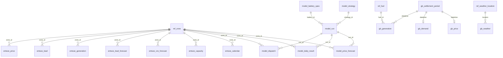

# Database reference

How the database is organised, how its tables key, and how to query it. The reasoning for
each structural choice lives in the migration that made it; this page is the map.

## Four schemas

| Schema | Holds | Grain | Rebuilt by |
| --- | --- | --- | --- |
| `ref` | Hand-curated modelling choices: zones, fuels, weather points | dimension rows | migrations, `load` (fuel), `load_zones` (zone) |
| `gb` | GB-only observed series from NESO and Elexon | half-hourly (weather hourly, commodities monthly) | `python -m gbmo.ingest.load` |
| `entsoe` | The European bidding-zone panel | hourly (capacity annual) | `python -m gbmo.ingest.load_zones` |
| `model` | Battery specs, strategies, runs and their outputs | per run | `python -m gbmo.arbitrage.backtest` |

**Always qualify table names.** `gb.price` and `entsoe.price` are different series, so an
unqualified `price` is ambiguous. `search_path` is deliberately left at its default for
that reason.

Rebuilding one schema never touches another's data. In particular, reloading `gb` leaves
`model` intact, because model outputs key on timestamps and a rebuild does not change them.

## Keys: three rules

1. **Time is a UTC timestamp named `datetime`**, naive (no zone attached), everywhere. It
   marks the *start* of the period or hour.
2. **Place is `zone_id`** → `ref.zone`, on every table that covers more than one area. The
   `gb` source tables are single-area by definition and carry none.
3. **A fact's primary key is its grain.** `(zone_id, datetime)` for an hourly panel fact,
   `(datetime, fuel_id)` for GB generation, `(run_id, zone_id, delivery_date)` for a daily
   model output. Any two facts with the same grain join on their keys directly.



## Tables

### ref

| Table | Key | Notes |
| --- | --- | --- |
| `zone` | `zone_id` (unique `code`) | 21 areas. `timezone` is civil time; `market_timezone` is the auction's (CET for every coupled zone, London for GB). `currency` is the price currency |
| `fuel` | `fuel_id` (unique `name`) | GB merit-order costing layer: `mc`, `carbon_factor`, `efficiency`, `commodity`, `is_dispatchable` |
| `weather_location` | `location` | The five GB weather points |

### gb

| Table | Key | Notes |
| --- | --- | --- |
| `settlement_period` | `datetime` | The GB calendar: `date`, `month`, `year`, `season`. `date` is the **UTC** date, not the GB settlement date |
| `generation` | `(datetime, fuel_id)` | MW by NESO fuel category |
| `demand` | `datetime` | `nd` (national demand) and `tsd` (transmission system demand), NESO definitions |
| `price` | `datetime` | Elexon Market Index Price, volume-weighted across providers, 2018 onward |
| `commodity_price` | `(year, month, commodity, source)` | Gas, coal, carbon and FX, stored per series so the modelling choices stay in the query |
| `weather` | `(datetime, location, variable)` | Open-Meteo reanalysis, hourly, long format with units |

### entsoe

| Table | Key | Notes |
| --- | --- | --- |
| `price` | `(zone_id, datetime)` | Day-ahead clearing price in `zone.currency` |
| `load` | `(zone_id, datetime)` | Actual total load, MW. ENTSO-E's definition, which differs from NESO's `demand` |
| `generation` | `(zone_id, datetime)` | Seven category columns in MW. **NULL** means not reported; **0** means reported zero. No total column: sum the categories |
| `load_forecast` | `(zone_id, datetime)` | The TSO's day-ahead load forecast |
| `vre_forecast` | `(zone_id, datetime)` | The TSO's day-ahead wind and solar forecasts |
| `capacity` | `(zone_id, year)` | Installed capacity by category. Sparse for IT_NORD, SE_3, SE_4, CH, GB: see `status.md` |
| `ingest` | `(zone_id, dataset, year)` | What was fetched, and at what native resolution (15, 30, 60 min; NULL for capacity) |
| `calendar` | `(zone_id, datetime)` | **Materialized view.** Every zone-hour with both clocks resolved: `local_datetime`, `local_date`, `local_hour`, `day_of_week` (1 = Mon), `is_weekend`, `month`, `year`, `delivery_date` |

Everything in `entsoe` is hourly. Source data at 15 or 30 minutes was averaged into the
hour on load; the unaggregated responses are in `data/raw/entsoe/`.

### model

| Table | Key | Notes |
| --- | --- | --- |
| `battery_spec` | `battery_id` | Power, capacity, round-trip efficiency, floor |
| `strategy` | `strategy_id` | `lp_perfect_foresight`, `naive_tod`, `lstm_mpc`, `rl_dqn` |
| `run` | `run_id` | One backtest: strategy, battery, commit, config, seed, window, and `price_source` (`gb_mid` or `entsoe_day_ahead`) |
| `dispatch` | `(run_id, zone_id, datetime)` | Per-period schedule. **GB only**, by the storage decision in `data-scaling.md` |
| `daily_result` | `(run_id, zone_id, delivery_date)` | Per-day summary for the panel, including `revenue` in the zone's currency |
| `price_forecast` | `(run_id, zone_id, origin, target)` | A forecast made at `origin` for `target`. The horizon is `target - origin` |

## Querying patterns

**Local time for a panel zone.** Join the calendar rather than converting timezones inline:

```sql
SELECT z.code, c.local_hour, avg(p.price) AS mean_price
FROM entsoe.price p
JOIN entsoe.calendar c USING (zone_id, datetime)
JOIN ref.zone z USING (zone_id)
WHERE c.year = 2024 AND NOT c.is_weekend
GROUP BY z.code, c.local_hour
ORDER BY z.code, c.local_hour;
```

**A delivery day** is `calendar.delivery_date`, the day the auction traded. Use it, not
`local_date`, whenever the question is about what a battery could do "in a day":

```sql
SELECT zone_id, delivery_date, max(price) - min(price) AS daily_spread
FROM entsoe.price JOIN entsoe.calendar USING (zone_id, datetime)
GROUP BY zone_id, delivery_date;
```

**Facts of the same grain** join on the full key, with no dimension in between:

```sql
SELECT p.zone_id, p.datetime, p.price, f.wind_mw, f.solar_mw, l.mw AS load_forecast_mw
FROM entsoe.price p
JOIN entsoe.vre_forecast  f USING (zone_id, datetime)
JOIN entsoe.load_forecast l USING (zone_id, datetime);
```

**GB against the panel.** GB's half-hours start on the hour and half hour, so truncating to
the hour aligns them with ENTSO-E's grain:

```sql
SELECT date_trunc('hour', datetime) AS datetime, avg(price) AS mid_price
FROM gb.price
GROUP BY 1;
```

**Revenue from dispatch** (GB) is a join, not a column: store what a run did, compute
what it earned.

```sql
SELECT d.run_id, sum((d.discharge_mw - d.charge_mw) * p.price * 0.5) AS revenue
FROM model.dispatch d
JOIN gb.price p USING (datetime)
GROUP BY d.run_id;
```

The `0.5` converts MW over a half-hour into MWh. For GB dispatch, `zone_id` is always GB's
and can be ignored in the join.

## What is deliberately not here

- **Stored totals, percentages and shares.** Computable in the query, so they stay there.
- **A `country` level of aggregation stored anywhere.** Use `ref.zone.country_code`, and
  aggregate outcomes rather than prices (see `status.md` for why that order matters).
- **Converted currencies.** Every panel price in this build is EUR, confirmed against the
  platform by `entsoe --verify`; the zone's currency is on `ref.zone` if that changes.
